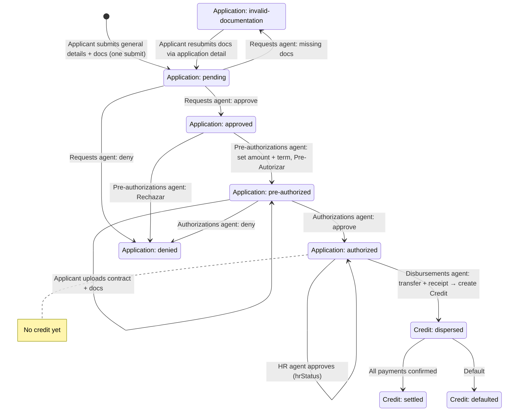

# TopCredit — App Flow (start to finish)

High-level, end-to-end flow for the **new app**, from first application to fully paid credit, plus who does what per role.

---

## 1. New application (applicant flow)

| Step | Screen | Action | Resulting state |
|------|--------|--------|-----------------|
| 1.1 | **Dashboard** (applicant) | If the applicant has no applications, they are redirected to **New application** (`/dashboard/applications/new`). Signup should collect only **full name** and **email**. | — |
| 1.2 | **New application** (applicant) | Applicant submits **general details** in **one submit**: salary, payroll/employee number, RFC (13 chars), interbank CLABE (18 digits), street and number, optional interior number, city, state, country (default `México`), postal code (5 chars), and phone number. Salary follows the company's pay frequency (`quincenal` / `mensual`). Applicant also uploads initial docs: official ID (INE or passport), proof of address (<= 3 months), bank statement (<= 3 months), and payroll slip (<= 1 month). Applicant does **not** choose term nor credit amount. | Application created with status `pending`. |
| 1.3 | *(agent)* **Requests** (agent, requests) | Requests agent (in `/app`, company selected) sees applications in `pending`. Reviews docs and approves or rejects each one. Then **Approve** (→ `approved`), **Missing documentation** (→ `invalid-documentation`), or **Deny** (→ `denied`). Only **approved** moves to the next queue; requests agent does not set pre-authorized. | Application → `invalid-documentation` / `approved` / `denied`. |
| 1.3b | **Application detail** (applicant) | If status is `invalid-documentation`, applicant opens the application on the **application detail** page and **resubmits** the documents that were invalid (replace or add). Submits for review again. | Application → `pending`. |
| 1.4 | *(agent)* **Pre-authorizations** (agent, pre-authorizations) | Pre-authorizations agent sees only applications in `approved`. For each, **sets loan amount** and **term** (dropdown from company term offerings). Validations: max loan from salary + company capacity; admin can override. Then **Pre-Autorizar** or **Rechazar**. Only this role can move an application to pre-authorized. | Application → `pre-authorized` or `denied`. |
| 1.5 | **Pre-authorized** (applicant) | Applicant sees the pre-authorized offer (amount, term). Signs **contract**, uploads **contract docs**, **payroll receipt**, **authorization**, and any other required docs. Submits for review. | Application stays `pre-authorized`; contract and docs uploaded for authorizations to review. |
| 1.6 | *(agent)* **Authorizations** (agent, authorizations) | Authorizations agent reviews `pre-authorized` applications: contract + uploaded docs. Chooses **Authorize** or **Deny** (reason required when denying). | Application → `authorized` or `denied`. |
| 1.7 | *(agent)* **HR** (agent, hr) | HR agent (company-scoped in `/app`) sees `authorized` applications for their company. Opens each, sets **first discount date**, and clicks **Aprobar** to approve HR side. | Application stays `authorized`; `hrStatus` set to `approved`. |
| 1.8 | **Authorized** (applicant) | Applicant sees the application as **authorized** and waits for disbursement. | Application stays `authorized`. |
| 1.9 | *(agent)* **Disbursements** (agent, dispersions) | Disbursements agent sees only `authorized` applications with `hrStatus: approved`. For each, fills **bank transfer data** (account, reference, amount), attaches **receipt** (proof of transfer), and submits. The system creates a **Credit** from the application, sets the disbursement date, stores transfer data + receipt, and generates the payment schedule. | Credit created with status `dispersed`. |
| 1.10 | **Dispersed** (applicant) | Applicant sees the credit in **My credits** with total amount, term, schedule, and next payment due. | Credit visible as `dispersed`. |

---

## 2. After the credit

| Step | Who | What |
|------|-----|------|
| 2.1 | Applicant | In **My credits** / dashboard, sees all active credits, each with status (`dispersed`, later `settled`/`defaulted`), payment schedule, and next payment. |
| 2.2 | Applicant | Opens **payment history** for a credit: weekly/bi-weekly expected payments showing due date, amount, and status (pending / confirmed). |
| 2.3 | *(agent – hr)* | HR agent marks each payment as confirmed (`hrConfirmedAt`) when payroll deduction has been applied. |
| 2.4 | Applicant | Once all scheduled payments are confirmed, the credit is marked `settled`; applicant sees the credit as **complete** and moved out of active credits. |
| 2.5 | *(agent – payments)* | Payments agents can view company/credit payments and completed credits views for reporting. |

---

## 3. Application and credit status

- **Application:** `pending` (created in one submit with general details + docs) → `invalid-documentation` | `approved` → (pre-authorizations agent sets amount + term) → `pre-authorized` | `denied` → (applicant submits contract/docs) → `pre-authorized` → `authorized` | `denied`. From `invalid-documentation`, applicant resubmits invalid docs via the application detail page → back to `pending`.
- **Credit:** Created only at **Disbursement** from an `authorized` + HR approved application; then `dispersed` → `settled` | `defaulted`.

---

## 4. Who does what after application submission?

| Role key | Where | Responsibility |
|----------|--------|----------------|
| `requests` | `/app` (company selected) | Review `pending` applications, approve/reject docs. Set status to **approved** (→ next queue), **invalid-documentation**, or **denied**. Only pre-authorizations role can set pre-authorized. |
| `pre-authorizations` | `/app` | See only `approved` applications. Set **loan amount** and **term** per application; validations (max loan, capacity). Then **Pre-Autorizar** (→ `pre-authorized`) or **Rechazar** (→ `denied`). Only this role can pre-authorize. |
| `authorizations` | `/app` | Review `pre-authorized` applications (contract + docs uploaded by applicant). Authorize or deny with reason. |
| `hr` | `/app` (company-scoped) | For `authorized` applications, set first discount date and approve HR side (`hrStatus: approved`); after disbursement, confirm payments (`hrConfirmedAt`); see completed credits. |
| `dispersions` | `/app` | For authorized + HR approved applications, fill bank transfer data and attach receipt; submit to create Credit and mark it `dispersed`. |
| `payments` | `/app` | View and manage company/credit payments and reporting. |
| `admin` | `/app` | Configure companies, terms, users, and agent–company assignments; can view data as an agent for any company or overview. |

---

## 5. Roles overview

| Role key | Main access |
|----------|------------|
| `applicant` | `/dashboard`: new application, application detail, my credits, payment history. |
| `agent` | Base role required for `/app`. Combined with the keys below to shape access. |
| `requests` | Review pending applications and approve (→ approved), missing docs, or deny. |
| `pre-authorizations` | See approved applications only; set loan amount and term; Pre-Autorizar or Rechazar. |
| `authorizations` | Final approval/denial of pre-authorized applications (after applicant uploads contract/docs). |
| `hr` | HR approval and payment confirmation for credits. |
| `dispersions` | Disbursement execution, credit creation, and transfer recording. |
| `payments` | Payments and collections views. |
| `admin` | Companies, terms, users, and assignments; full configuration access. |
